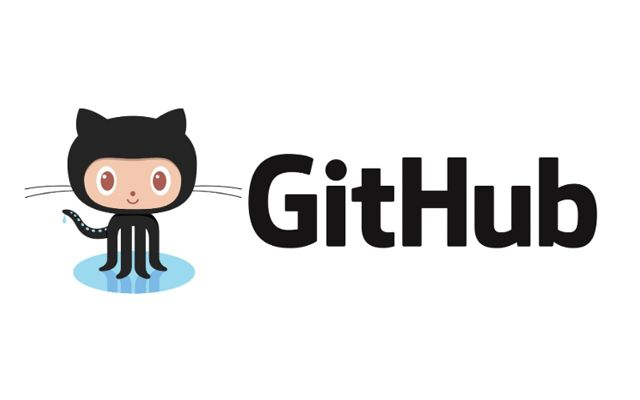

#  **Presentaciò Final**
 continuació, presento una selecció dels projectes que he desenvolupat al llarg del curs, reflectint el meu aprenentatge i evolució com a professional IT

### 🚀 Projecte 1 · Introducció al treball professional:

**Objectiu del projecte:**
Aquest projecte té com a finalitat aprendre a treballar com si estiguéssim en una empresa real des del primer moment.
No es centra tant en crear un producte final, sinó en millorar l’organització, la planificació i el treball en equip utilitzant metodologies com Kanban.
El mòdul de Projecte Intermodular actua com a client, fent el seguiment, supervisant i assegurant que es compleixi la metodologia.

**Què vaig treballar:**
- Introducció a GitHub
- Treball col·laboratiu
- Gestió i seguiment de tasques
- Creació de documentació bàsica

🔗 [Veure repositori](https://github.com/usuario/proyecto1)

### 🚀 Projecte 2 Consultoria EverPia:

**Objectiu del projecte:**

Aquest projecte simula el funcionament d’una consultora IT real, on ens incorporem com a consultors júnior.
Cada encàrrec representa una situació diferent, però tots tenen com a finalitat desenvolupar capacitats d’adaptació, organització i visió global.
Es treballa seguint metodologies com Kanban, amb seguiment constant del “client” (Projecte Intermodular).

**Què vaig treballar:**
- Treball en entorn professional simulat
- Organització amb metodologia Kanban (Planner)
- Gestió del backlog de tasques
- Ús de GitHub i documentació amb Markdown
- Resolució de casos tècnics reals (sistemes, xarxes, hosting, web…)
- Presentació i defensa de projectes

🔗[Veure repositori](https://github.com/usuario/proyecto2)

### 🚀 Projecte 03. Sobreviure en una empresa IT: 

**Objectiu del projecte:**

Aquest projecte se centra en gestionar una infraestructura IT en funcionament, simulant situacions reals d’una empresa en creixement.
L’objectiu és aprendre a resoldre incidències, mantenir serveis actius i treballar sota pressió amb metodologia àgil.

**Què vaig treballar:**
- Resolució d’incidències i problemes reals
- Gestió de serveis IT (DNS, LDAP, LVM…)
- Manteniment i optimització de sistemes
- Documentació tècnica amb GitHub i Markdown
- Treball sota pressió i gestió del temps
- Treball en equip i comunicació

🔗 [Veure repositori](https://github.com/usuario/proyecto3)

### 🚀 Projecte 04. Desafiament final:

**Objectiu del projecte:**

Aquest projecte representa la fase final del procés formatiu, on es posen en pràctica tots els coneixements adquirits en un entorn professional.
L’objectiu és demostrar autonomia, criteri tècnic i capacitat per afrontar projectes complets amb una visió global.

**Què vaig treballar:**

- Integració de coneixements en sistemes, xarxes i aplicacions web
- Gestió de backups i recuperació de sistemes
- Desplegament de serveis IT (NFS, CUPS, SSH, accés remot)
- Ús de Git i control de versions
- Disseny de prototips digitals amb Figma
- Documentació tècnica completa
- Organització amb metodologia Kanban
- Treball autònom, resolució de problemes i presa de decisions

🔗[Veure repositori](https://github.com/usuario/proyecto4)

``
### 🚀 Projecte 05 La incubadora:

**Objectiu del projecte**

Aquest projecte consisteix en crear una empresa IT des de zero dins d’un entorn simulat, treballant com un equip emprenedor.
L’objectiu és integrar tots els coneixements adquirits i aprendre a plantejar, desenvolupar i defensar una proposta real davant d’un “comitè d’inversió”.

**Què vaig treballar:**

- Anàlisi de problemes reals i definició de clients
- Disseny d’un model de negoci viable
- Desenvolupament d’una proposta tecnològica
- Creació de prototips i validació de la idea
- Estudi de costos, riscos i viabilitat
- Preparació i defensa d’un pitch (presentació)
- Treball en equip i presa de decisions
- Desenvolupament del perfil professional i orientació de carrera

🔗[Veure repositori](https://github.com/usuario/proyecto4)

### 🚀 Projecte 06 Nexus:

**Objectiu del projecte:**

Aquest projecte consisteix en dissenyar i desplegar una solució de servidor per a una plataforma E-learning, pensada per a una empresa real.
L’objectiu és analitzar necessitats, escollir tecnologies adequades i presentar una solució eficient, sostenible i viable.

**Què vaig treballar:**

- Desplegament i configuració d’un servidor web
- Comparativa de tecnologies (Nginx vs Apache)
- Anàlisi de rendiment, recursos i manteniment
- Estudi de costos i viabilitat (VPS)
- Proposta tècnica justificada
- Planificació de tasques i estimació del treball
- Comunicació de solucions a un client

🔗[Veure repositori](https://github.com/usuario/proyecto4)

### 🚀Projecte 07 FoodLogístic S.A.

**Objectiu del projecte**

Aquest projecte consisteix en dissenyar i proposar una solució completa per a una empresa real en creixement, millorant la seva infraestructura IT, comunicació, seguretat i presència web.
L’objectiu és oferir una proposta professional amb desplegament, costos i planificació realista.

**Què vaig treballar**

- Configuració de serveis en alta disponibilitat (fitxers i impressió)
- Migració i anàlisi de serveis al núvol (Microsoft 365, Google Workspace)
- Seguretat de dades i normativa LOPD
- Creació de contingut formatiu per a usuaris
- Disseny d’una pàgina web corporativa
- Elaboració de pressupostos (cost inicial i manteniment)
- Planificació de tasques i calendari d’implantació
- Documentació tècnica i presentació al client

🔗 [Veure repositori](https://github.com/usuario/proyecto4)

### 🚀 Projecte 8. Connecta't al Futur:

**Objectiu del projecte:**

Aquest projecte consisteix a actuar com a consultor tecnològic per ajudar petites i mitjanes empreses en el seu procés de digitalització.
L’objectiu és analitzar necessitats reals i proposar solucions tecnològiques que millorin l’eficiència, la seguretat i la competitivitat.

**Què vaig treballar**

- Anàlisi de necessitats de clients reals
- Disseny de solucions IT personalitzades
- Assessorament en processos de transformació digital
- Aplicació de criteris de sostenibilitat (ODS)
- Proposta de solucions eficients i responsables
- Treball en equip i enfocament professional

🔗[Veure repositori](https://github.com/usuario/proyecto4)

# 🚧 Problemas que vaig tenir 🚧

Durant el desenvolupament del projecte vaig trobar diverses dificultats relacionades amb l’ús de les eines de treball i l’adaptació als nous entorns.

## 💻 Adaptació al treball amb GitHub

Al principi em va costar adaptar-me a treballar amb GitHub, ja que no estava acostumat a utilitzar aquesta plataforma.
Vaig necessitar temps per entendre el funcionament dels repositoris, els commits i la manera correcta de gestionar els projectes.

## 🛠️ Canvi a Visual Studio

Més endavant vaig començar a utilitzar Visual Studio, però vaig fer el canvi una mica tard.
Això va provocar que em costés adaptar-me al nou entorn de treball i a les seves eines.

## ⚠️ Problemes per pujar els treballs

També vaig tenir problemes perquè des de Visual Studio no se’m pujaven correctament els treballs a GitHub.
Aquest error em va fer perdre temps i vaig haver de buscar una solució.

Finalment, vaig aconseguir solucionar-ho utilitzant els comandos que ens van ensenyar a classe.

## ✅ Conclusió

Tot i les dificultats, aquesta experiència em va ajudar a aprendre a utilitzar millor les eines de desenvolupament i a continuar treballant en el projecte sense més problemes.
